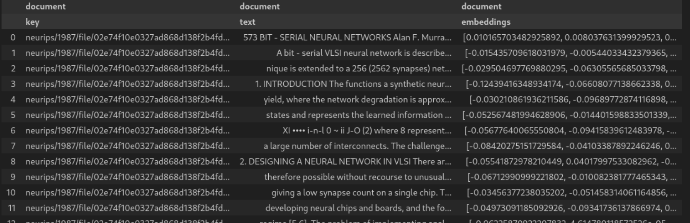

# Scalable PDF documents processing with DataChain and Unstructured.io

## Datachain and LLMs - Part I

Most organiations keep a large source of information in the form of various internal documents, call transcripts and other unstructured data. These data contain a lot of useful insights about customers, employees or the inner workings of the company. However, they remain largely untapped by data teams due to the difficulty of dealing with large quantities of data in unstructured formats.

Today, we will see how you can process a collection of documents in less than 60 lines of code and turn them into vector embeddings which are much easier to work with and useful downstream (e.g. as ML features or for RAG applications). This approach is also scalable and you will benefit from easy versioning of the final datasets.

### Approach and tools

We will work with a publicly available Google Storage bucket which contains a collection of Neurips conference papers (representing our internal company documents).

For data processing we will use the  [unstructured](https://github.com/Unstructured-IO/unstructured) Python library which contains a lot of useful functionality for unstructured data processing.

With unstructured we will:
* Easily process each document
* Partition and clean it
* Create vector embeddings from the partitions

We will also use [DataChain](https://github.com/iterative/datachain), which is an open-source Python data-frame library which helps ML and AI engineers to build a metadata layer on top of unstructured files. That way, we do not have to copy the original files anywhere or load them all to memory, significantly scaling up the volume of data we can process.

With [DataChain](https://github.com/iterative/datachain), we will:
* Easily search and filter our data container to only load the documents we need
* Scale up the document processing with unstructured.io to the level of our entire document collection
* Save the results as versioned datasets in tabular format, ready for processing downstream

Both libraries can be easily installed with pip.

```
pip install unstructured datachain
```
(In this example we are using `unstructured` version `0.15.7`)

### Full working code

Here you can have a look at the full code used in our example which you can run (and we will upack in a second) This code will load our document collection with DataChain and create a DataChain UDF (user-defined function) `process_pdf` which will load, partition and clean the text and create vector embeddings using `unstructured`. It then saves (and automatically versions) the resulting dataset containing the embeddings, cleaned human-readable text and a reference key for all of the original documents.

```python
from typing import List
from collections.abc import Iterator

from datachain import DataChain, C, File, DataModel

from unstructured.partition.pdf import partition_pdf

from unstructured.cleaners.core import clean
from unstructured.cleaners.core import replace_unicode_quotes
from unstructured.cleaners.core import group_broken_paragraphs

from unstructured.embed.huggingface import HuggingFaceEmbeddingConfig, HuggingFaceEmbeddingEncoder

# Define the output as a DataModel class
class Chunk(DataModel):
    key: str
    text: str
    embeddings: List[float]

# Define embedding encoder

embedding_encoder = HuggingFaceEmbeddingEncoder(
     config=HuggingFaceEmbeddingConfig()
)

# Use signatures to define UDF input/output (these can be pydantic model or regular Python types)
def process_pdf(file: File) -> Iterator[Chunk]:
    # Ingest the file
    with file.open() as f:
        chunks = partition_pdf(file=f, chunking_strategy="by_title", strategy="fast")

    # Clean the chunks and add new columns
    for chunk in chunks:
        chunk.apply(lambda text: clean(text, bullets=True, extra_whitespace=True, trailing_punctuation=True))
        chunk.apply(replace_unicode_quotes)
        chunk.apply(group_broken_paragraphs)

    # create embeddings
    chunks_embedded = embedding_encoder.embed_documents(chunks)

    # Add new rows to DataChain
    for chunk in chunks_embedded:
        yield Chunk(
            key=file.path,
            text=chunk.text,
            embeddings=chunk.embeddings,
        )

dc = (
    DataChain.from_storage("gs://datachain-demo/neurips")
    .settings(parallel=-1)
    .filter(C.file.path.glob("*.pdf"))
    .gen(document=process_pdf)
)

dc.save("embedded-documents")

DataChain.from_dataset("embedded-documents").show()
```
The resulting dataset will look like this:



### How it works

#### Creating and saving the DataChain

The following few lines of code are all that we need to load and select the right data in from our storage and to process them with `unstructured`.

```python
dc = (
    DataChain.from_storage("gs://datachain-demo/neurips")
    .settings(parallel=-1)
    .filter(C.file.path.glob("*.pdf"))
    .gen(document=process_pdf)
)
```

Let's unpack:

The `from_storage` and `filter` methods allow us to ingest the data from a bucket/storage container. Since DataChain uses lazy evaluation, no other files than those specified by the `filter` will be loaded, speeding up the process considerably. Setting `parallel` to `-1` tells DataChain to make use of all CPUs/cores on the current machine, speeding things up once again.

This will create a DataChain metadata table containing all the information needed to process our PDF files without actually having to copy the files themselves or load them all to memory. Since DataChain operates on a metadata level, it can scale up billions of files without us having to worry about memory overflows.

The `gen` method allows us to modify the datachain table and create new rows (potentially more than one per original table row) using datachain UDF functions. Here, the UDF `process_pdf` does all the individual PDF processing with `unstructured`.

Finally, we save the table as a dataset by calling 

```python
dc.save("embedded-documents")
```

This will persist the table and version it (each time we call this command a new version is created automatically). We can then load and display it by the following command, optionally specifying the dataset version

```python
DataChain.from_dataset("embeddings", version=1).show()
```

All that's missing is the DataChain UDF definition, so let's see how we do that.

#### Defining the UDF

The `process_pdf` UDF will take the original datachain table and produce an output with `embeddings` of processed document chunks. We also want to keep the original `text` of each processed document chunk and a `key` by which we can link each chunk back to the original full document.

We first specify what we actually want to receive on the output of our UDF by defining the `DataModel`-based `Chunk` class and defining the output column types:

```python
# Define the output as a DataModel class
class Chunk(DataModel):
    key: str
    text: str
    embeddings: List[float]
```

Now we are ready to define the `process_pdf` function itself. We use Python signatures to specify the input and output. Here, `File` is a class used by Datachain to refer to the original file - a PDF document in our case. On the output we use `Iterator` since our function will produce multiple chunks (and so multiple rows in our DataChain table) per original file.

```python
def process_pdf(file: File) -> Iterator[Chunk]:
```

The rest of the function definition as well as the definition of `embedding_encoder` specifies how `unstructured` is used to process each individual PDF file. For more detail on how this is done and what other PDF processing options there are you can check out the tutorial in the [unstructured documentation](https://docs.unstructured.io/open-source/core-functionality/overview).

Finally, we want the UDF to produce new rows in our DataChain table and so we have it return the Chunk objects we specified above. Here, we use `yield` instead of `return` as each PDF file produces several Chunk objects.

```python
    # Add new rows to DataChain
    for chunk in chunks_embedded:
        yield Chunk(
            key=file.path,
            text=chunk.text,
            embeddings=chunk.embeddings,
        )
```

### Summary

We have processed our collection of documents to create a dataset of embeddings in a scalable fashion. We could now proceed with optimizing the workflow, choosing the best way way to preprocess our data by trying different parsing and data cleaning strategies, different embedding etc. (and if we have a GPU, we can speed up data processing even further by configuring the embedding config to use it). Unstructured provides many tools for such fine-tuning and daset versioning with Datachain is a useful tool to compare the different iterations.

Stay tuned for Part II, where we will explore a use-case where we will use a similar approach to process call centre recordings to create and process transcripts.